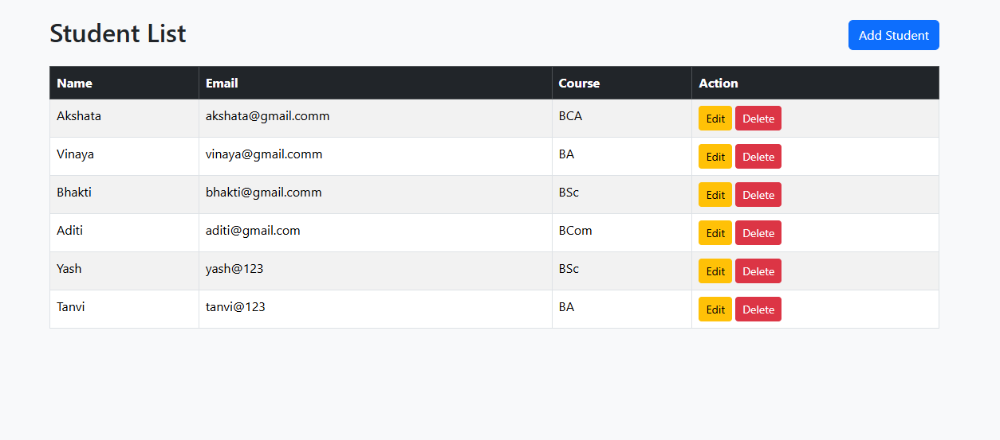

# Student Management System (Django)

A simple **Student Management System** built using **Python Django** that performs basic **CRUD operations** (Create, Read, Update, Delete) on student records.

This project is developed as a **BCA academic / practice project** to understand Django fundamentals and database handling.

---

## 🚀 Features
- Add new student details  
- View student list  
- Edit student information  
- Delete student records with confirmation  
- Simple and user-friendly interface  

---

## 🛠️ Technologies Used
- Python  
- Django  
- HTML  
- CSS  
- SQLite (Default Django Database)  

---

## 📂 Project Structure
student-management-system/
│
├── student_management/
│ ├── settings.py
│ ├── urls.py
│
├── students/
│ ├── models.py
│ ├── views.py
│ ├── urls.py
│ └── templates/
│ └── students/
│ ├── add_student.html
│ └── student_list.html
│
├── db.sqlite3
├── manage.py
└── README.md


---

## 📸 Screenshots

### ➕ Add Student


### 📋 Student List


---

## ⚙️ How to Run This Project

### 1️⃣ Clone the repository
```bash
git clone https://github.com/akshatapandit-cyber/student-management-system.git
2️⃣ Go to project directory
cd student-management-system

3️⃣ Install Django
pip install django

4️⃣ Run migrations
python manage.py migrate

5️⃣ Start the server
python manage.py runserver

6️⃣ Open browser and visit
http://127.0.0.1:8000/

📚 Learning Outcomes

Understanding Django MVT architecture

Performing CRUD operations using Django ORM

Handling forms and templates

Working with databases

URL routing and views

👩‍💻 Author

Akshata Sham Pandit
BCA Student
Aspiring Python & Django Developer


